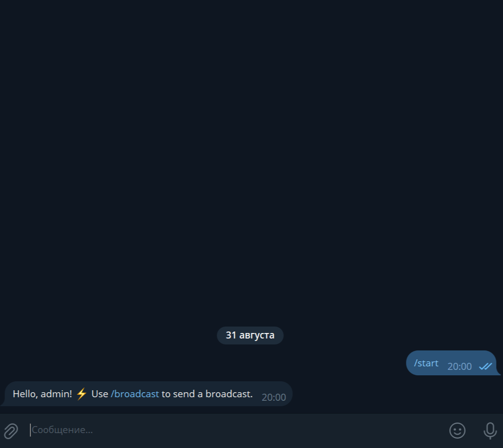
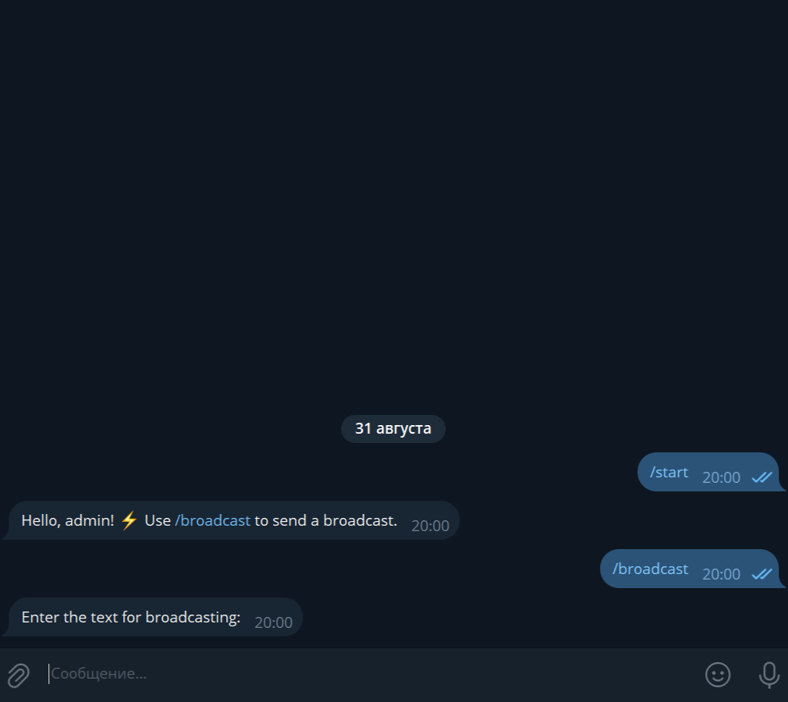
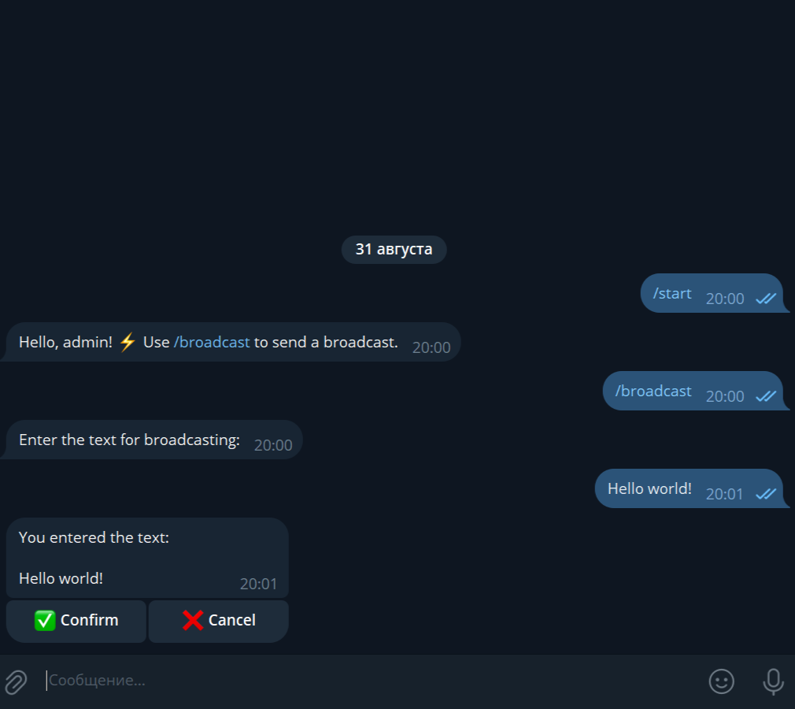
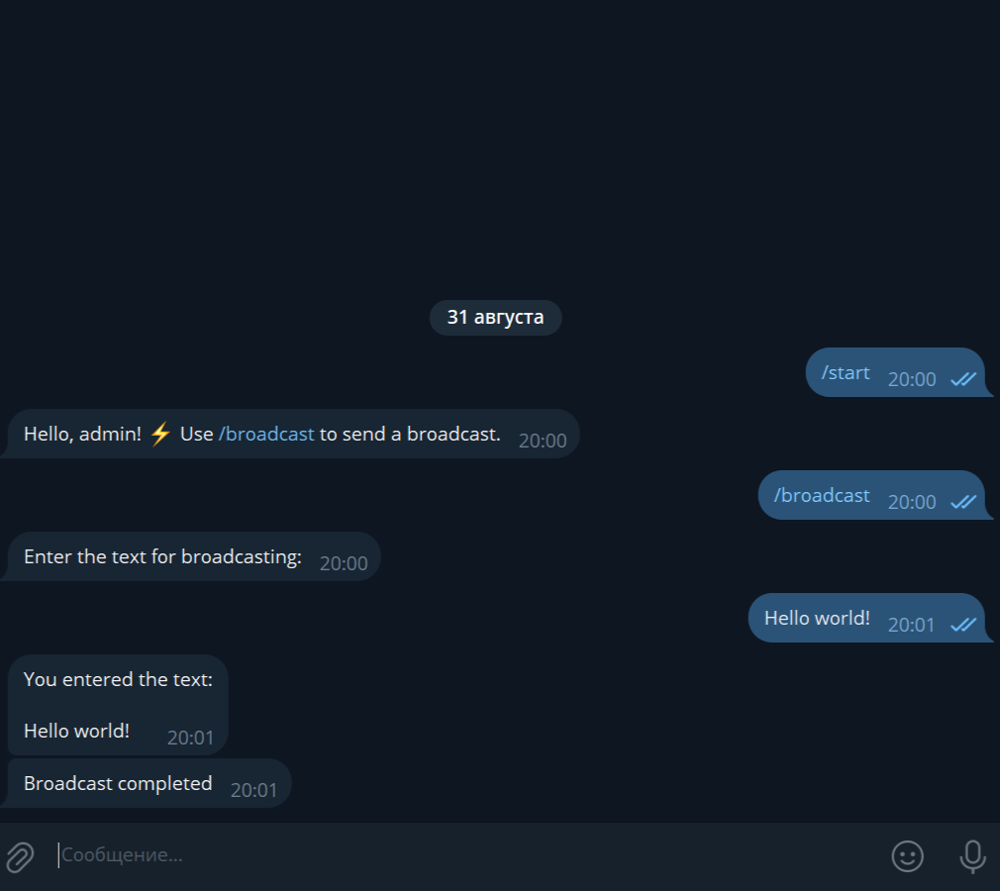
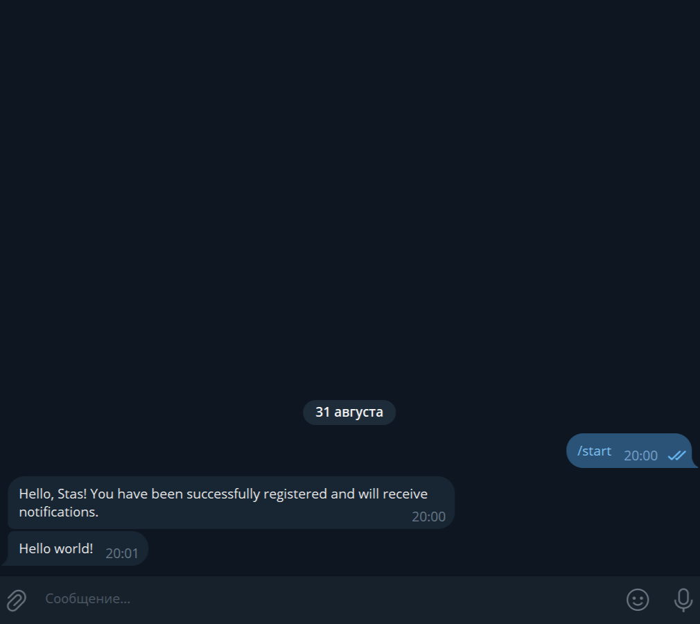

# BroadcastBot

**BroadcastBot** — a Telegram bot for mass notification broadcasting.  
Allows the administrator to send messages to all registered users with convenient confirmation before sending.

---

## 📌 Features

- **User Registration**  
  Automatically saves user IDs in the database when the bot is first started.

- **Roles**  
  Differentiates between the administrator (by `ADMIN_ID`) and regular users.

- **Mass Broadcasting**  
  - The `/broadcast` command is available to the administrator only.  
  - FSM for entering text and confirming before sending.  
  - Asynchronous broadcasting with a delay between messages.  

- **Subscriber Management**  
  - Automatically removes users from the database if they block the bot or delete their account.  
  - Handles other errors without data loss.

---

## 💻 Technologies and Dependencies

- **Python**  
- **aiogram==3.22.0**  
- **python-dotenv==1.1.1**  
- **aiofiles==24.1.0**  
- **aiosqlite==0.21.0**

---

### Creating a `.env` File

1. In the project root, create a file named `.env`.
2. Open `.env` in any text editor and add the following lines:

```ini
TOKEN=YOUR_TOKEN
ADMIN_ID=YOUR_ID
```

- ⚠️ Enter the token and ID without spaces or quotes after the = sign.

---

## ⚙️ Installation and Running

```bash
# Clone the project or download the archive

# Create a virtual environment
python -m venv .venv

# Activate the virtual environment on Windows
.venv\Scripts\activate

# Activate the virtual environment on Linux/Mac
source .venv/bin/activate

# Install dependencies
pip install -r requirements.txt

# Run the bot
python main.py
```

---

## ⚡ Features

- Simple user registration in SQLite.
- FSM for confirming text before broadcasting.
- Asynchronous sending with pauses for stable operation.
- Automatic removal of inactive users.
- Clean architecture with logic separated into modules.

---

## 📸 Screenshots and Demo

### Start Greeting (Administrator)


### Entering Text for Broadcast


### Confirmation and Broadcasting


### Broadcast Completion


### Regular User (Greeting and Broadcast)
