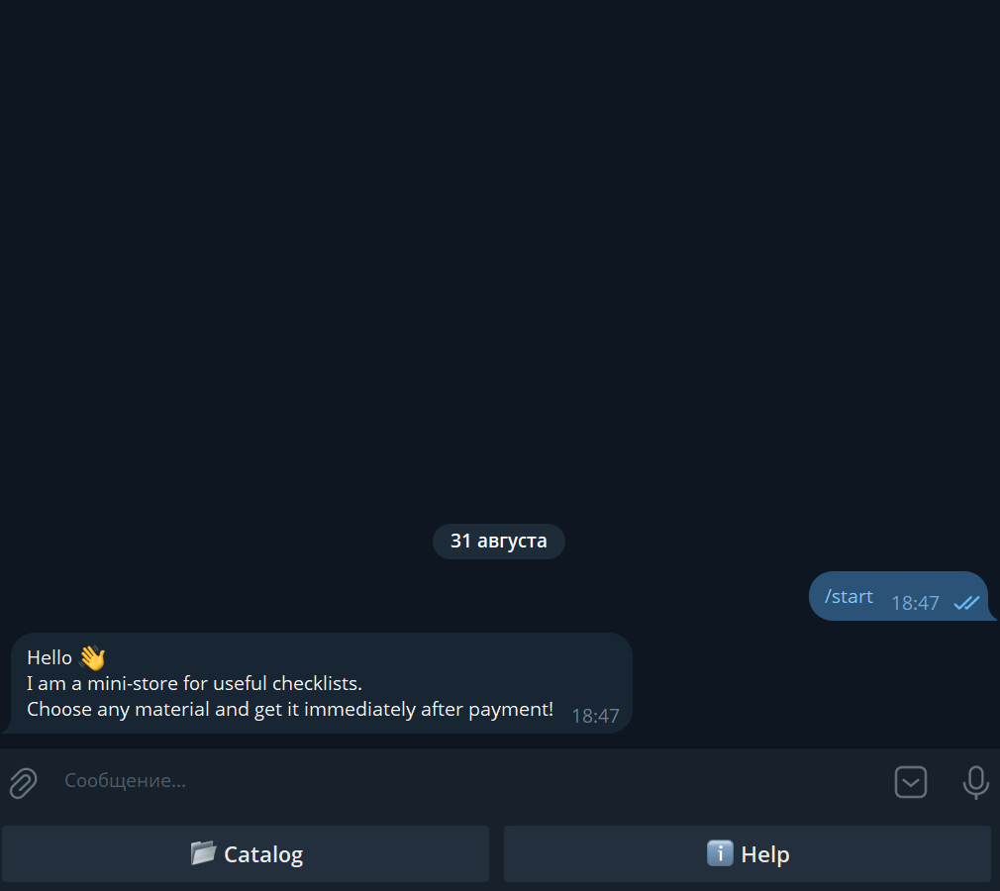
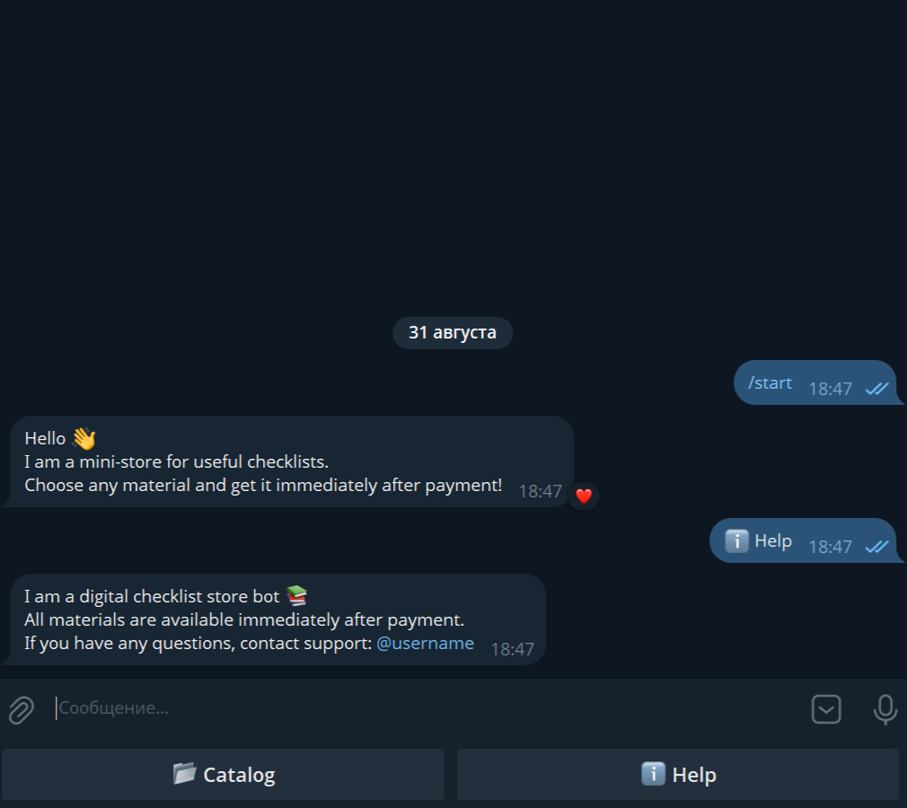
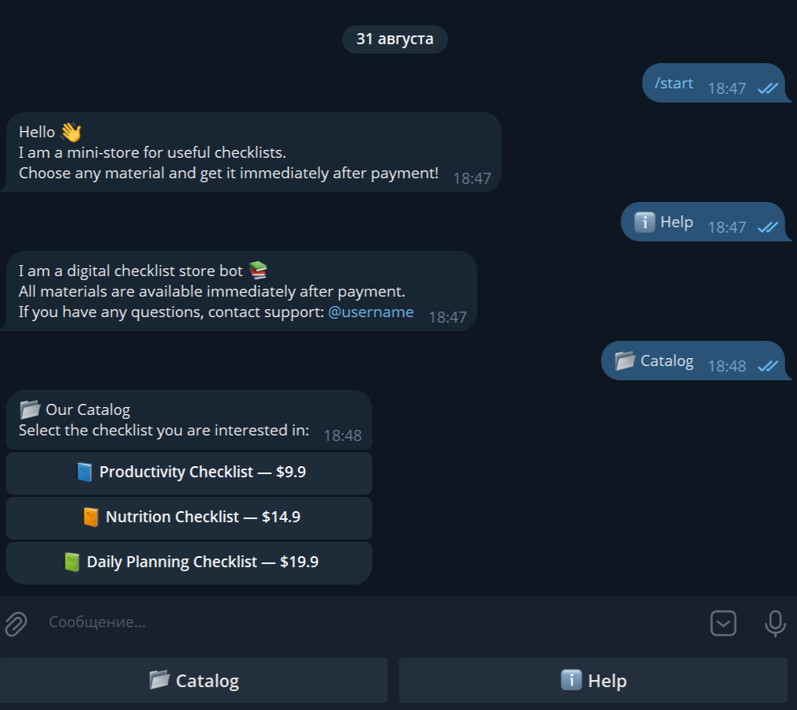
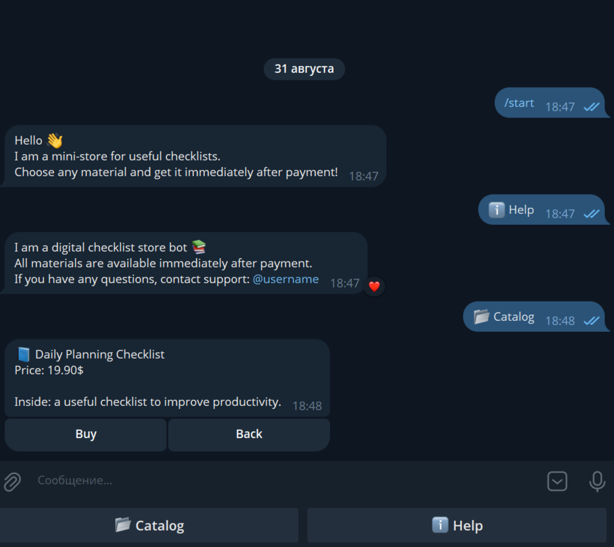
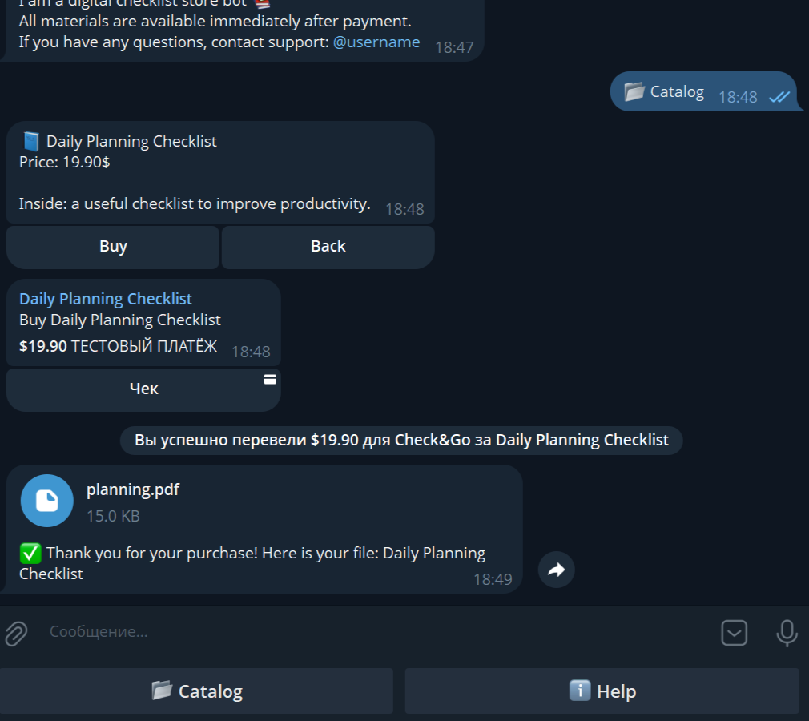

# Check&Go — Mini Digital Checklist Store in Telegram

**Check&Go** is a Telegram bot where users can purchase various useful checklists. All materials are available immediately after payment, and the purchase process is fully automated via Telegram Payment.

---

## 🚀 Key Features

- **Greeting and Main Menu**  
  The bot responds to the `/start` command, sending a welcome message with a reply keyboard containing two buttons:  
  - 📂 Catalog  
  - ℹ️ Help

- **Help Section**  
  The ℹ️ Help button provides information about the bot and support contact.

- **Product Catalog**  
  The 📂 Catalog button opens a list of available checklists with their prices. Each item is represented by a separate inline button.

- **Product Details**  
  Selecting a specific checklist shows the product information and updates the keyboard to:  
  - Buy — to pay for the product  
  - Back — to return to the catalog

- **Payment and Delivery**  
  Pressing the "Buy" button initiates Telegram Payment.  
  After successful payment, the user automatically receives the corresponding PDF file.

- **Support for Multiple Products**  
  The bot supports a catalog of multiple checklists, each with its own information, price, and file.  

---

## 💻 Technologies and Dependencies

- **Python**  
- **aiogram==3.22.0**  
- **python-dotenv==1.1.1**  
- **aiofiles==24.1.0**  
- **pydantic==2.11.7**

---

### Creating the `.env` File

1. In the project root, create a file named `.env`.
2. Add the following lines:

```ini
TOKEN=YOUR_TOKEN
PAYMENT_PROVIDER_TOKEN=YOUR_PROVIDER_TOKEN
```

- ⚠️ Insert the tokens without spaces or quotes after the =

---

## ⚙️ Installation and Running

```bash
# Clone the project or download the archive

# Create a virtual environment
python -m venv .venv

# Activate the virtual environment on Windows
.venv\Scripts\activate

# Activate the virtual environment on Linux/Mac
source .venv/bin/activate

# Install dependencies
pip install -r requirements.txt

# Run the bot
python main.py
```

---

## 🎯 Features

- Automatic delivery of PDF files after successful payment via Telegram Payment.
- Use of reply and inline keyboards for interactive user experience.
- Clean and clear code structure, demonstrating skills with **aiogram** and asynchronous logic.
- Support for a catalog with multiple checklists, each with its own price and file.

---

## 📸 Screenshots and Demo

### Main Menu


### "Help" Button


### Product Catalog


### Product Details


### Successful Purchase
