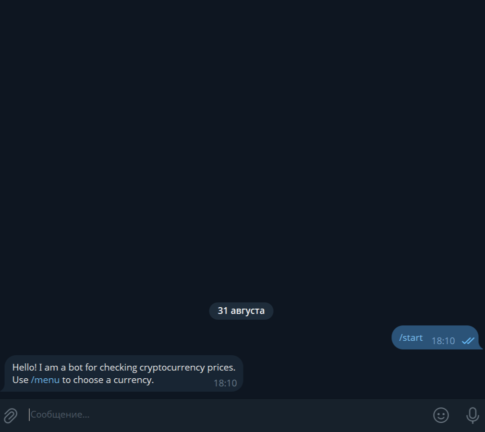

# CryptoPriceBot

**CryptoPriceBot** is a Telegram bot for tracking cryptocurrency prices in real-time. It supports Bitcoin, Ethereum, and Litecoin, displays the price in USD, and allows updating the price via a button.

---

## 📌 Features

- **`/start` command**  
  Sends a welcome message and instructions on how to use the bot.

- **`/menu` command**  
  Lets the user choose a cryptocurrency from the supported list using an inline keyboard.

- **View cryptocurrency prices**  
  The bot displays the current price of the selected currency in USD.

- **Price updates**  
  Allows updating the price of the selected currency using a button that edits the previous message.  
  Caching prevents excessive API requests.

- **Error handling**  
  - Handles API unavailability or missing data.  
  - Handles selection of unsupported currencies.

---

## 💻 Technologies and Dependencies

- **Python**  
- **aiogram==3.22.0**  
- **python-dotenv==1.1.1**  
- **aiofiles==24.1.0**
- **httpx==0.28.1**

**API:** [CoinGecko API](https://api.coingecko.com/api/v3)

---

### Creating a `.env` File

1. In the project root, create a file named `.env`.
2. Open `.env` in any text editor and add a single line:

```ini
TOKEN=YOUR_TOKEN
```

- ⚠️ Insert the token without spaces or quotes after TOKEN=

---

## ⚙️ Installation and Running

```bash
# Clone the project or download the archive

# Create a virtual environment
python -m venv .venv

# Activate the virtual environment on Windows
.venv\Scripts\activate

# Activate the virtual environment on Linux/Mac
source .venv/bin/activate

# Install dependencies
pip install -r requirements.txt

# Run the bot
python main.py
```

---

## ⚡ Highlights

- Asynchronous API requests using httpx.
- Inline keyboards provide convenient and interactive bot interaction.
- Price caching prevents excessive requests to the free API and reduces load.
- Clean code architecture with separate routers for `/start`, `/menu`, and callback handling.
- Supports multiple cryptocurrencies with the ability to expand the list.
- Handles API errors and invalid currency selections for reliable bot operation.

---

## 📸 Screenshots and Demo

### Main Menu


### Viewing Price


### Updating Price
