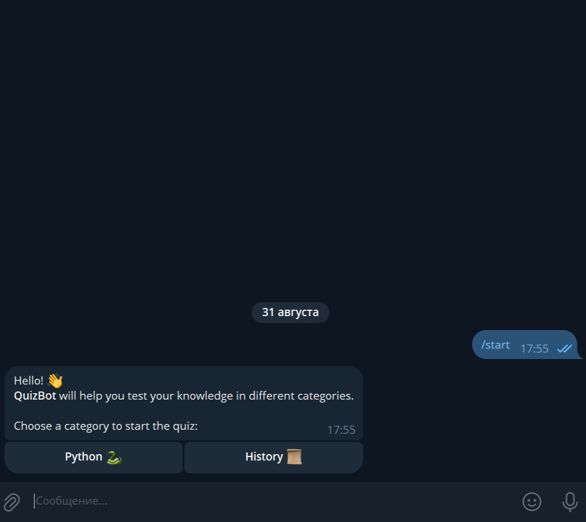
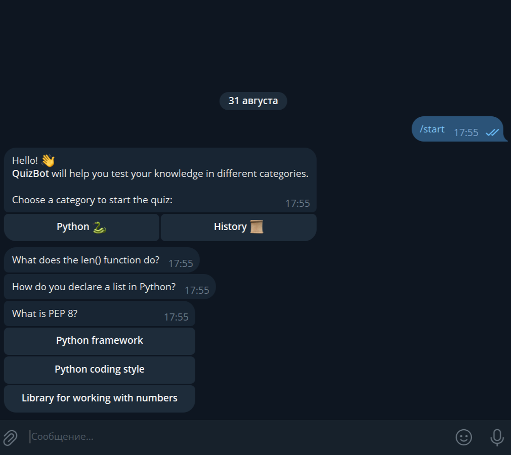
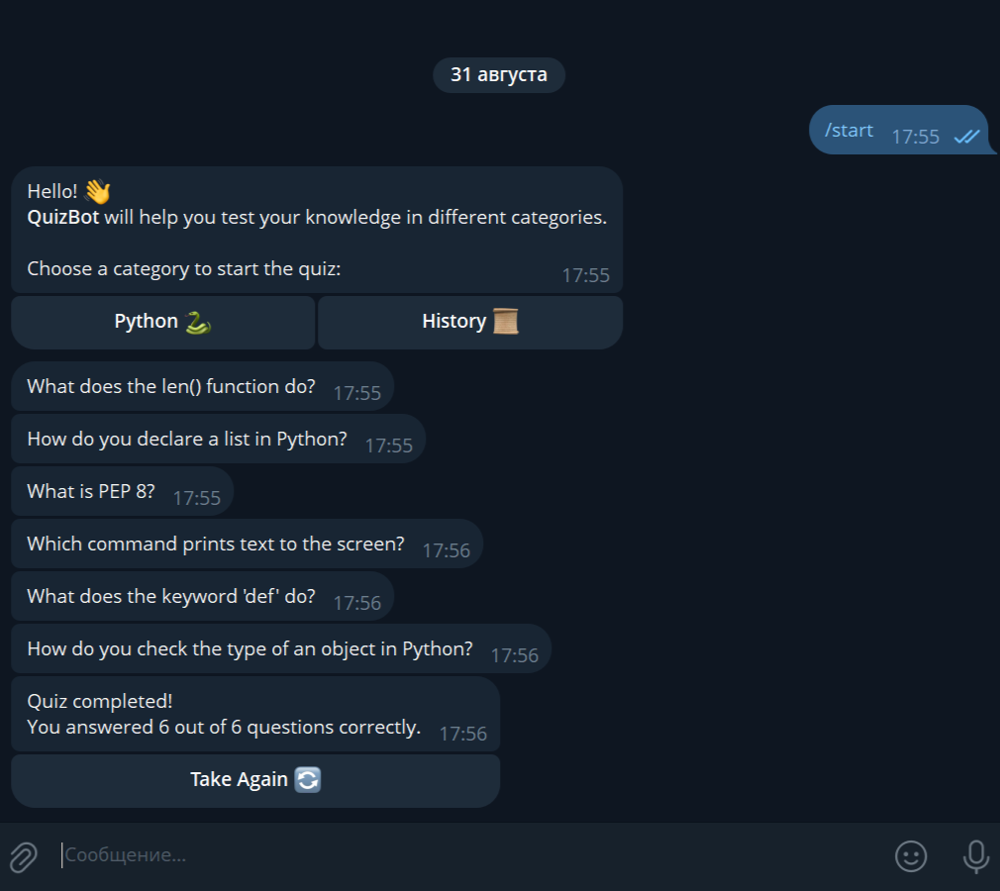
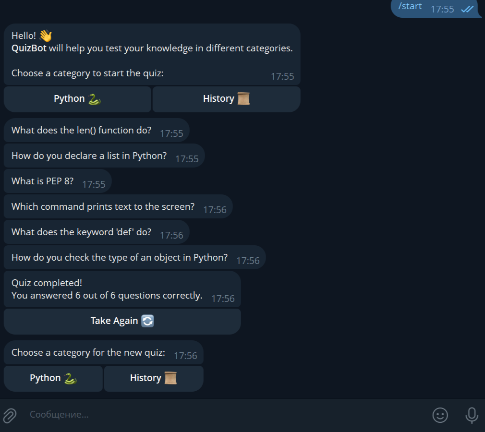

# QuizBot — Telegram Quiz

**QuizBot** is a simple Telegram bot for conducting quizzes by category. Users choose a category, answer questions, and the bot counts correct answers and allows retaking the quiz.

---

## 🚀 Key Features

- Greeting on the `/start` command with an inline keyboard to select a category:
  - **Python 🐍**  
  - **History 📜**
- **Taking the Quiz**:
  - Each category contains **6 questions**, each with **3 answer options**.
  - After selecting an answer, the inline keyboard is hidden to prevent accidental repeated clicks.
  - FSM tracks the user's progress and counts correct answers.
- **Restriction on starting a new quiz**:
  - If the user is already in a quiz, attempting to select a category triggers a `show_alert`: "Please finish the current quiz first!".
- **Quiz Result**:
  - After all questions, the bot sends:  
    `"Quiz completed! You answered X out of 6 questions correctly."`
  - An inline button **Take Again 🔄** is attached to start a new quiz.

---

## 💻 Technologies and Dependencies

- **Python**  
- **aiogram==3.22.0**  
- **python-dotenv==1.1.1**  
- **aiofiles==24.1.0**

---

### Creating a `.env` File

1. In the project root, create a file named `.env`.
2. Open `.env` in any text editor and add a single line:

```ini
TOKEN=YOUR_TOKEN
```

- ⚠️ Insert the token without spaces or quotes after TOKEN=

---

## ⚙️ Installation and Running

```bash
# Clone the project or download the archive

# Create a virtual environment
python -m venv .venv

# Activate the virtual environment on Windows
.venv\Scripts\activate

# Activate the virtual environment on Linux/Mac
source .venv/bin/activate

# Install dependencies
pip install -r requirements.txt

# Run the bot
python main.py
```

---

## 🎯 Features

- FSM to track quiz state and count correct answers.
- Inline keyboards make bot interaction interactive.
- Simple and clean code architecture to demonstrate skills with aiogram and asynchronous logic.

---

## 📸 Screenshots and Demo

### Main Menu


### Question with Answer Options


### Quiz Result


### Retake Quiz

