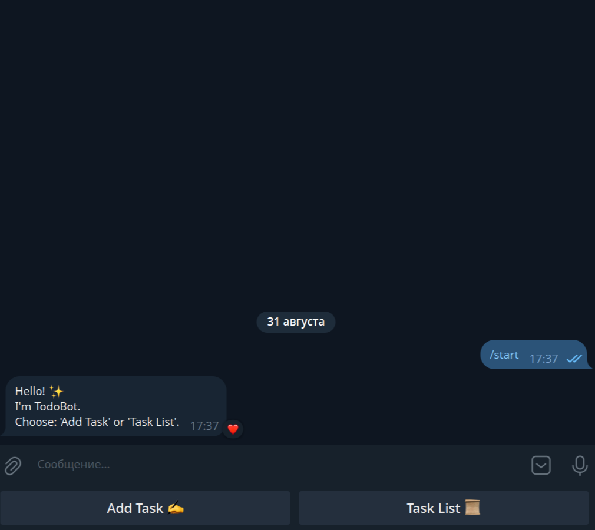
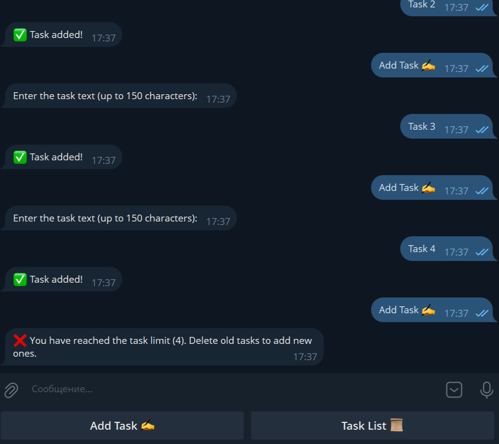
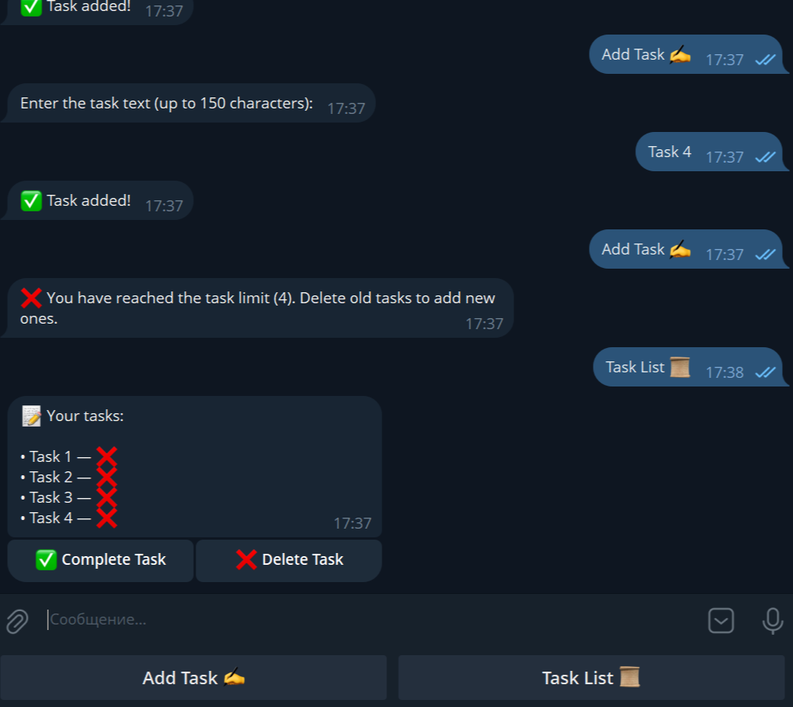
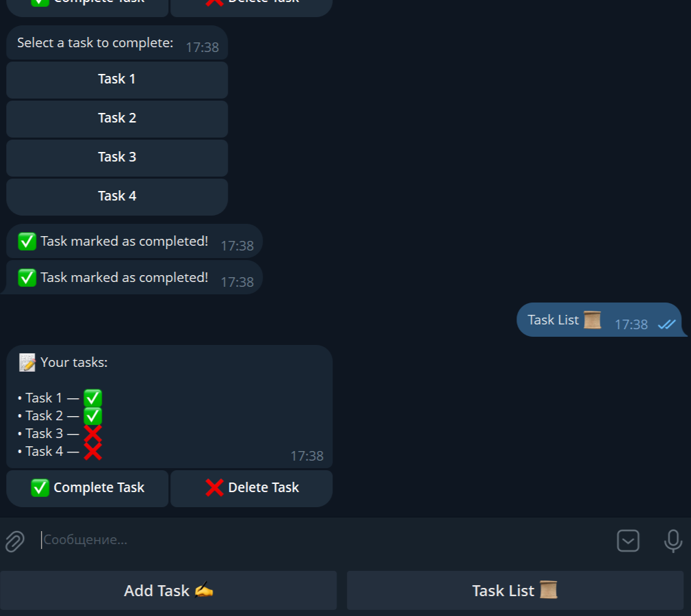
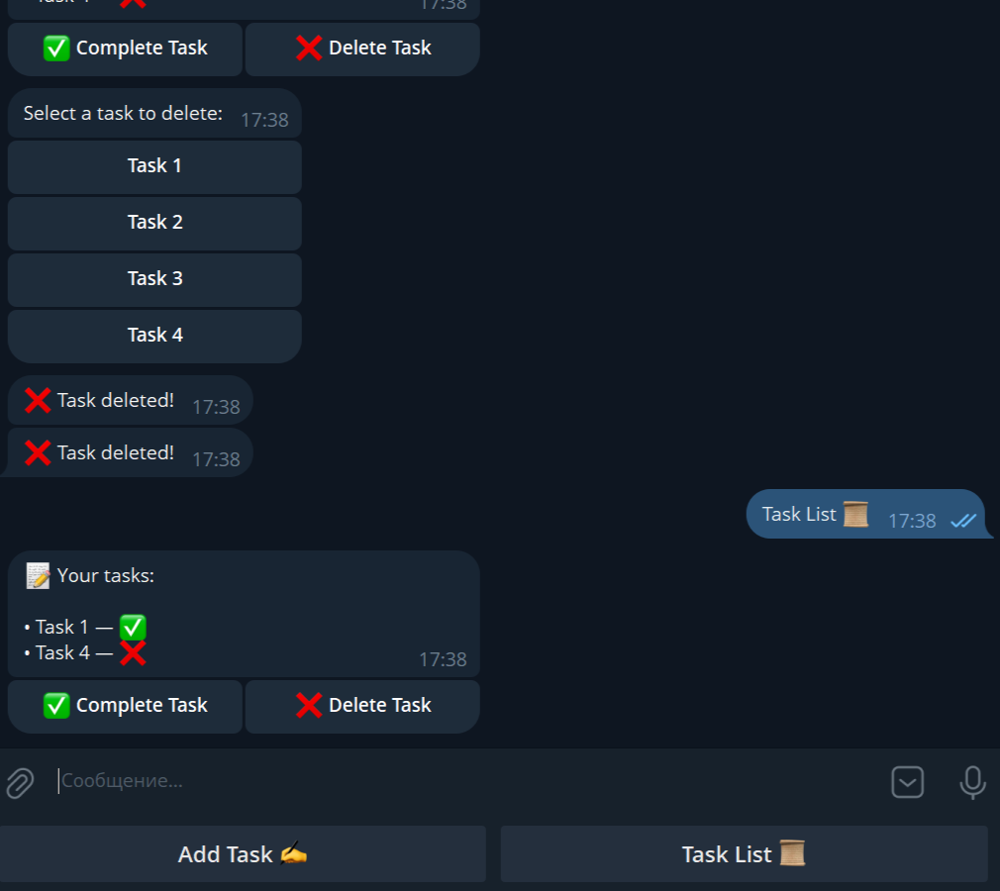

# TodoBot — Task Planner

**TodoBot** is a simple Telegram bot for task planning. It allows users to add tasks, track their status, and delete them as needed.

---

## 🚀 Key Features

- Greeting on the `/start` command with a reply keyboard:
  - **Add Task**  
  - **Task List**
- **Adding a Task**:
  - Enter task text up to 150 characters.
  - Limit: maximum **4 tasks per user**.
  - Tasks are saved in the database with the following fields: `id`, `user_id`, `task`, `status`.
- **Viewing Task List**:
  - Displays tasks with their status (`Completed` / `Not Completed`).
  - Inline keyboard with buttons:
    - **Complete Task**
    - **Delete Task**
- **Completing and Deleting Tasks** via the inline keyboard.

---

## 💻 Technologies and Dependencies

- **Python**  
- **aiogram==3.22.0**  
- **python-dotenv==1.1.1**  
- **aiofiles==24.1.0**  
- **aiosqlite==0.21.0**

---

### Creating a `.env` File

1. In the project root, create a file named `.env`.
2. Open `.env` in any text editor and add a single line:

```ini
TOKEN=YOUR_TOKEN
```

- ⚠️ Insert the token without spaces or quotes after TOKEN=

---

## ⚙️ Installation and Running

```bash
# Clone the project or download the archive

# Create a virtual environment
python -m venv .venv

# Activate the virtual environment on Windows
.venv\Scripts\activate

# Activate the virtual environment on Linux/Mac
source .venv/bin/activate

# Install dependencies
pip install -r requirements.txt

# Run the bot
python main.py
```

---

## 🎯 Features

- Task limit per user (4).
- FSM for task input and inline keyboards makes interaction interactive.
- Simple code architecture to demonstrate skills with **aiogram** and asynchronous databases.

---

## 📸 Screenshots and Demo

### Main Menu


### Adding a Task


### Task List


### Completing a Task


### Deleting a Task

