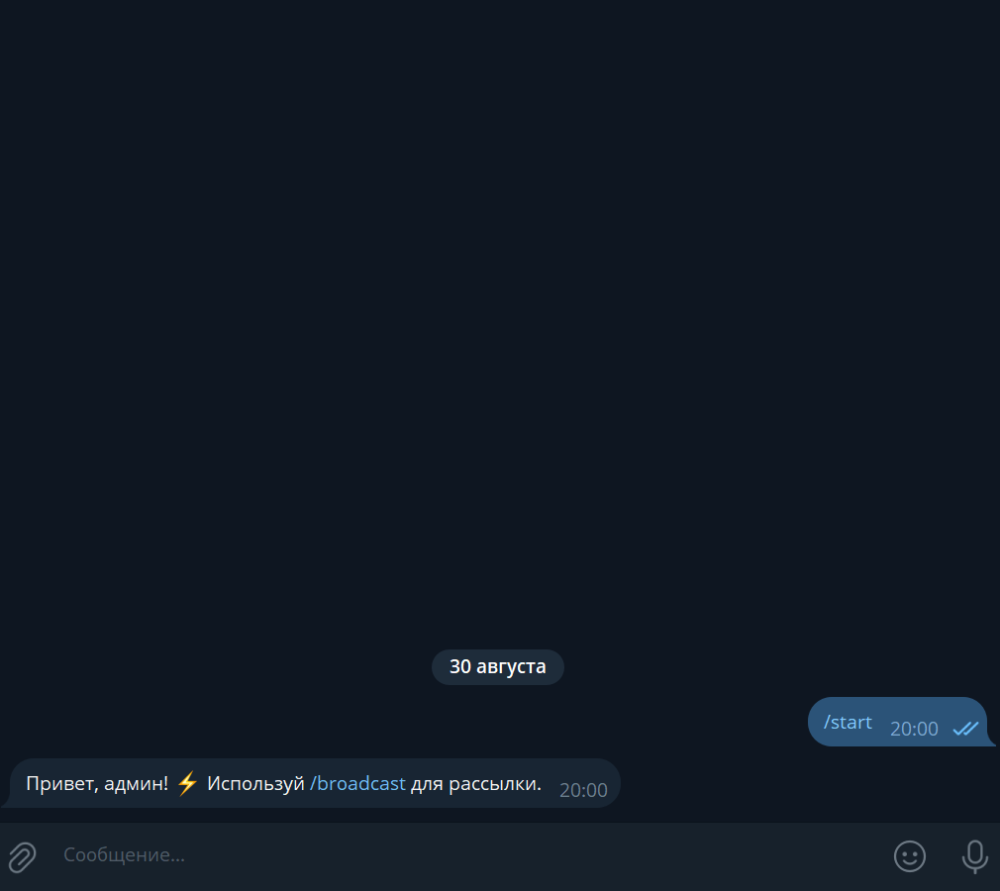
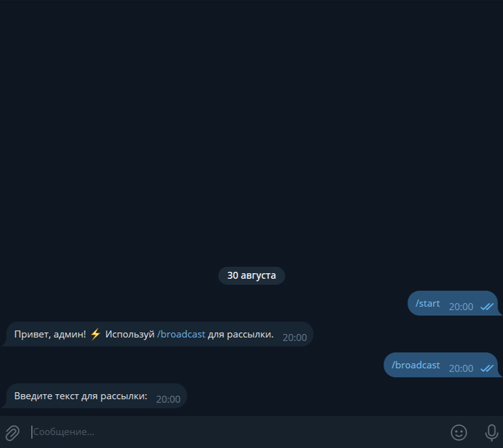
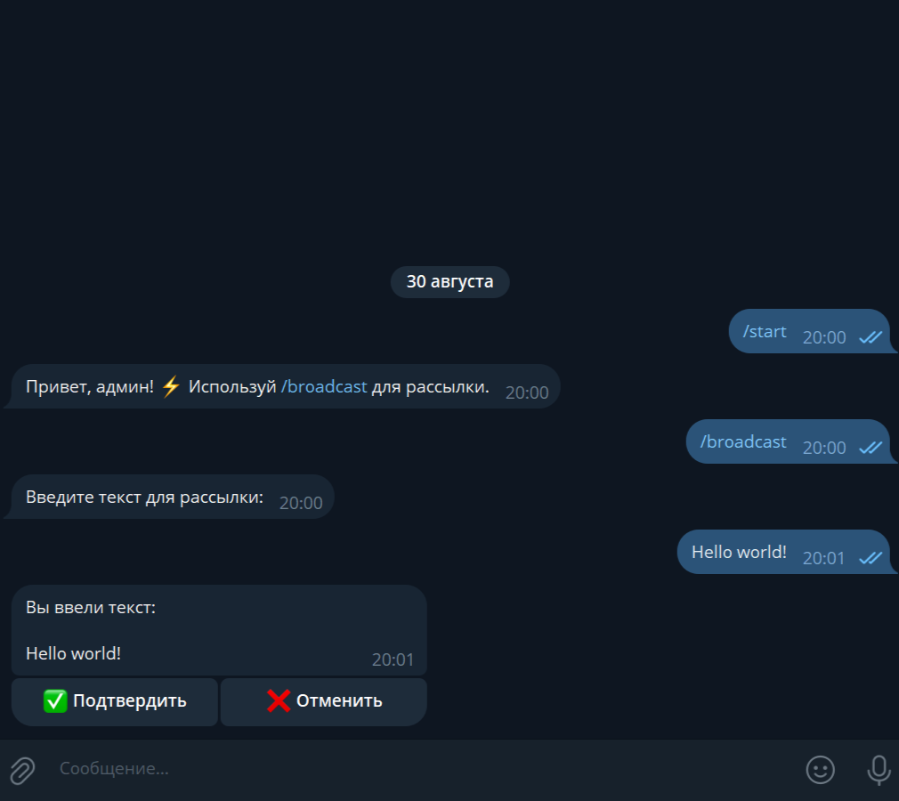
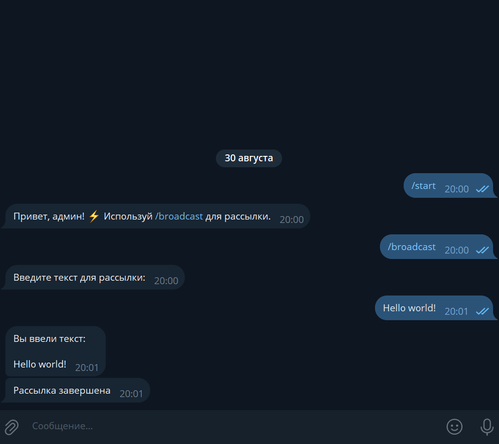
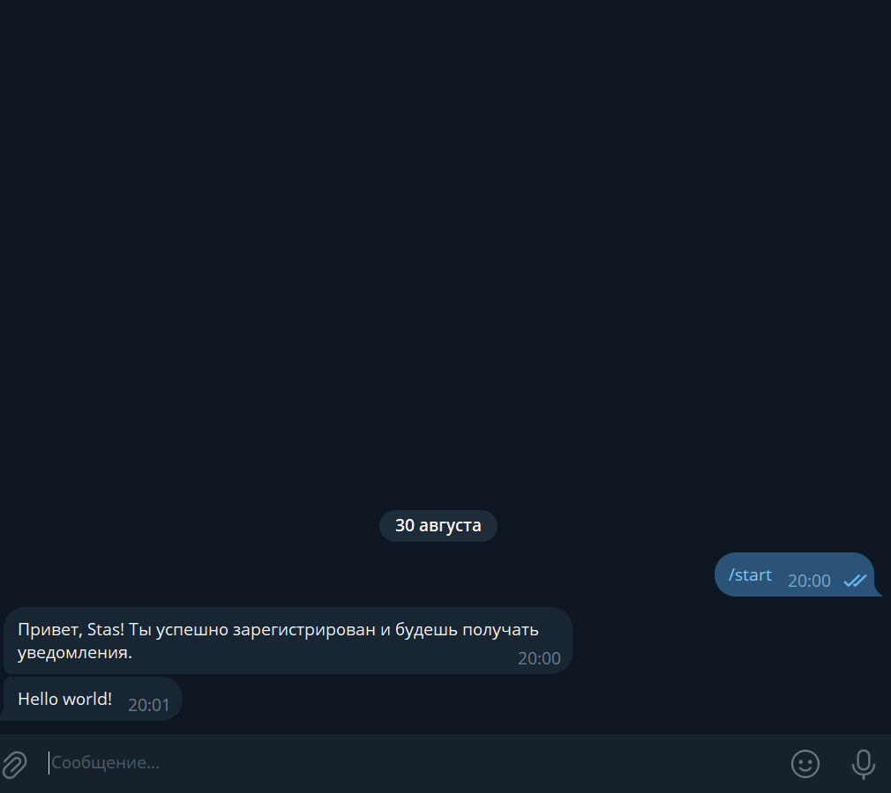

# BroadcastBot

**BroadcastBot** — Telegram-бот для массовой рассылки уведомлений.  
Позволяет администратору отправлять сообщения всем зарегистрированным пользователям с удобным подтверждением перед отправкой.

---

## 📌 Функционал

- **Регистрация пользователей**  
  Автоматическое сохранение ID в базе данных при первом запуске бота.

- **Роли**  
  Разделение пользователей на администратора (по `ADMIN_ID`) и обычных пользователей.

- **Массовая рассылка**  
  - Команда `/broadcast` доступна только администратору.  
  - FSM для ввода текста и подтверждения перед отправкой.  
  - Асинхронная рассылка с задержкой между сообщениями.  

- **Управление подписчиками**  
  - Автоматическое удаление из БД пользователей, заблокировавших бота или удаливших аккаунт.  
  - Обработка остальных ошибок без потери данных.

---

## 💻 Технологии и зависимости

- **Python**  
- **aiogram==3.22.0**  
- **python-dotenv==1.1.1**  
- **aiofiles==24.1.0**  
- **aiosqlite==0.21.0**

---

---

### Создание файла `.env`

1. В корне проекта создайте файл с именем `.env`
2. Откройте `.env` в любом текстовом редакторе и следующие строки:

```ini
TOKEN=ВАШ_ТОКЕН
ADMIN_ID=ВАШ_ID
```

- ⚠️ Токен и ID вставляйте без пробелов и кавычек после знака =

---

## ⚙️ Установка и запуск

```bash
# Клонируем проект или скачиваем архив

# Создаем виртуальное окружение
python -m venv .venv

# Активируем виртуальное окружение на Windows
.venv\Scripts\activate

# Активируем виртуальное окружение на Linux/Mac
source .venv/bin/activate

# Устанавливаем зависимости
pip install -r requirements.txt

# Запускаем бота
python main.py
```

---

## ⚡ Особенности

- Простая регистрация пользователей в SQLite.
- FSM для подтверждения текста перед рассылкой.
- Асинхронная отправка с паузами для стабильной работы.
- Автоматическое удаление неактивных пользователей.
- Чистая архитектура с разделением логики по модулям.

---

## 📸 Скриншоты и демонстрация

### Стартовое приветствие (администратор)


### Ввод текста для рассылки


### Подтверждение и рассылка


### Завершение рассылки


### Обычный пользователь (приветствие и рассылка)
