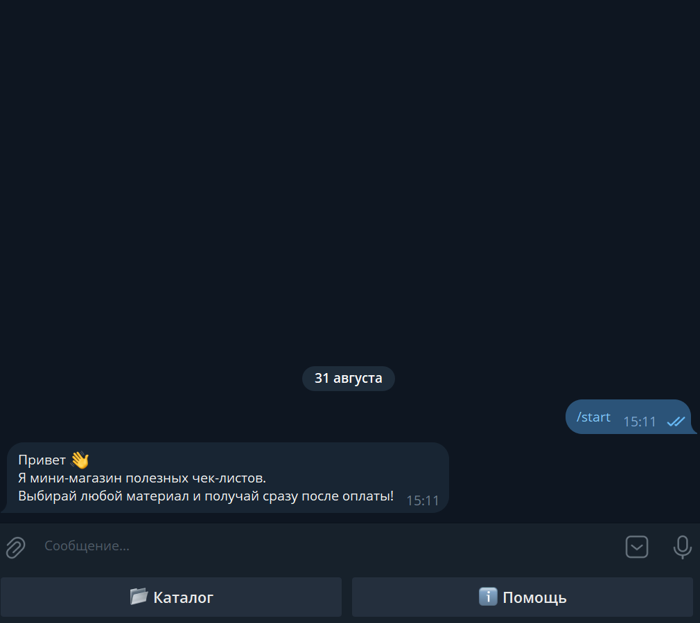
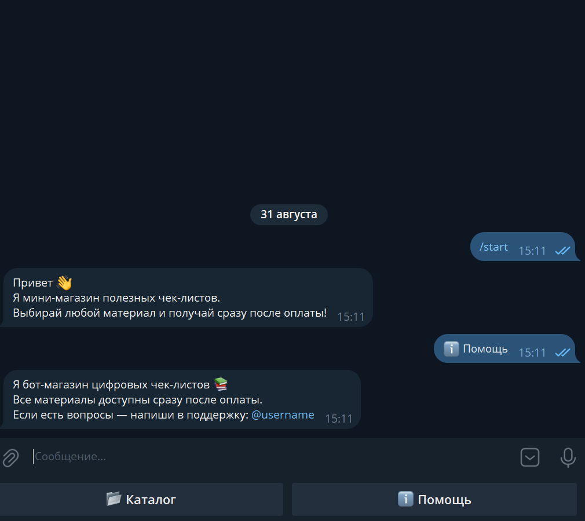
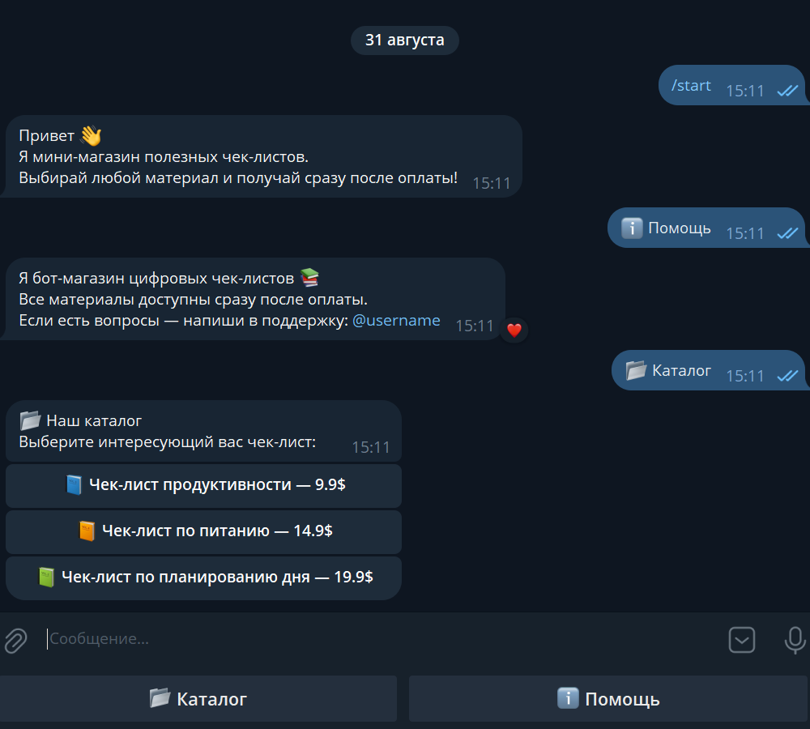
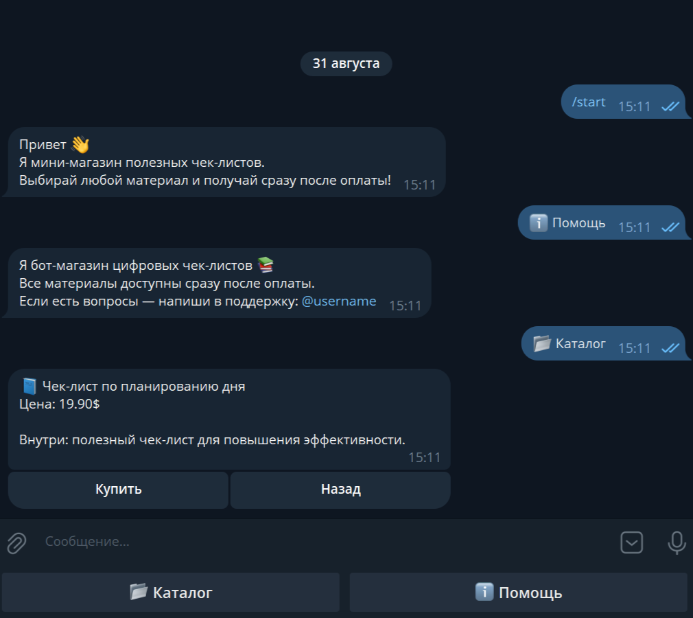
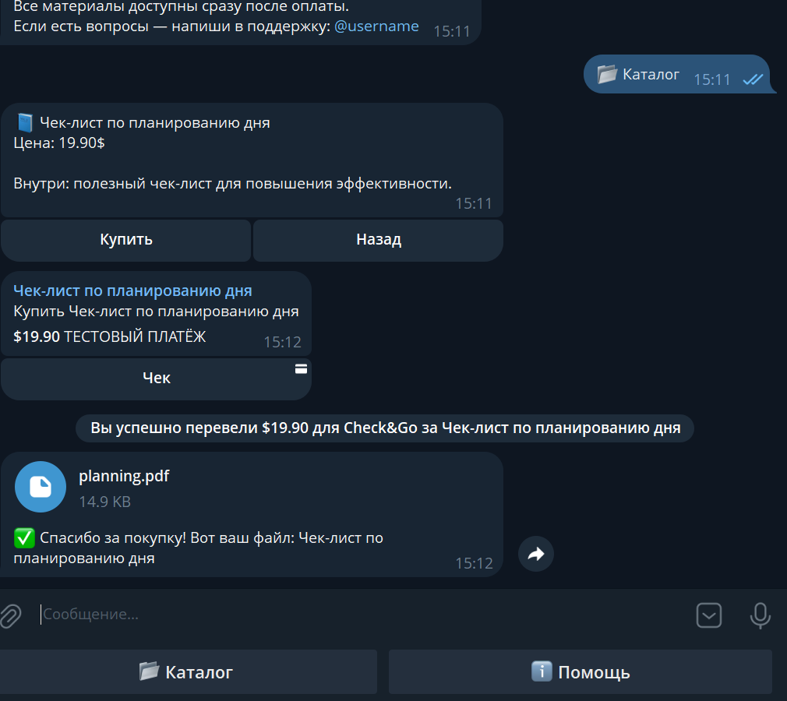

# Check&Go — Мини-магазин цифровых чек-листов в Telegram

**Check&Go** — это Telegram-бот, в котором можно приобрести различные полезные чек-листы. Все материалы доступны сразу после оплаты, а процесс покупки полностью автоматизирован через Telegram Payment.

---

## 🚀 Основные возможности

- **Приветствие и главное меню**  
  Бот реагирует на команду `/start`, отправляя приветственное сообщение с reply-клавиатурой, содержащей две кнопки:
  - 📂 Каталог
  - ℹ️ Помощь

- **Раздел помощи**  
  Кнопка ℹ️ Помощь выводит информацию о боте и контакт поддержки.

- **Каталог товаров**  
  Кнопка 📂 Каталог открывает список доступных чек-листов с указанием цены. Каждый товар представлен отдельной inline-кнопкой.

- **Детали товара**  
  При выборе конкретного чек-листа отображается информация о товаре и изменяется клавиатура на:
  - Купить — для оплаты товара
  - Назад — возвращение к списку товаров

- **Оплата и доставка**  
  При нажатии на кнопку "Купить" бот инициирует Telegram Payment.  
  После успешной оплаты пользователь получает соответствующий PDF файл автоматически.

- **Поддержка нескольких товаров**  
  Бот поддерживает каталог из нескольких чек-листов с индивидуальной информацией, ценой и файлом для каждой позиции.

---

## 💻 Технологии и зависимости

- **Python**  
- **aiogram==3.22.0**  
- **python-dotenv==1.1.1**  
- **aiofiles==24.1.0**  
- **pydantic==2.11.7**

---

### Создание файла `.env`

1. В корне проекта создайте файл с именем `.env`
2. Добавьте следующие строки:

```ini
TOKEN=ВАШ_ТОКЕН
PAYMENT_PROVIDER_TOKEN=ВАШ_ПРОВАЙДЕР_ТОКЕН
```

- ⚠️ Вставляйте токены без пробелов и кавычек после =

---

## ⚙️ Установка и запуск

```bash
# Клонируем проект или скачиваем архив

# Создаем виртуальное окружение
python -m venv .venv

# Активируем виртуальное окружение на Windows
.venv\Scripts\activate

# Активируем виртуальное окружение на Linux/Mac
source .venv/bin/activate

# Устанавливаем зависимости
pip install -r requirements.txt

# Запускаем бота
python main.py
```

---

## 🎯 Особенности

- Автоматическая доставка PDF файлов после успешной оплаты через Telegram Payment.
- Использование reply- и inline-клавиатур для интерактивного взаимодействия с пользователем.
- Чистая и понятная структура кода для демонстрации навыков работы с **aiogram** и асинхронной логикой.
- Поддержка каталога с несколькими чек-листами, каждый со своей ценой и файлом.

---

## 📸 Скриншоты и демонстрация

### Главное меню


### Кнопка "Помощь"


### Каталог товаров


### Детали товара


### Успешная покупка
