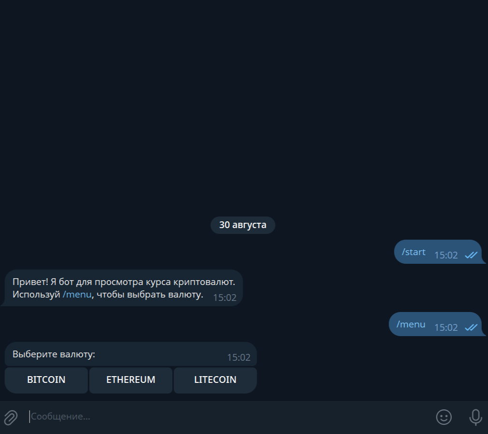
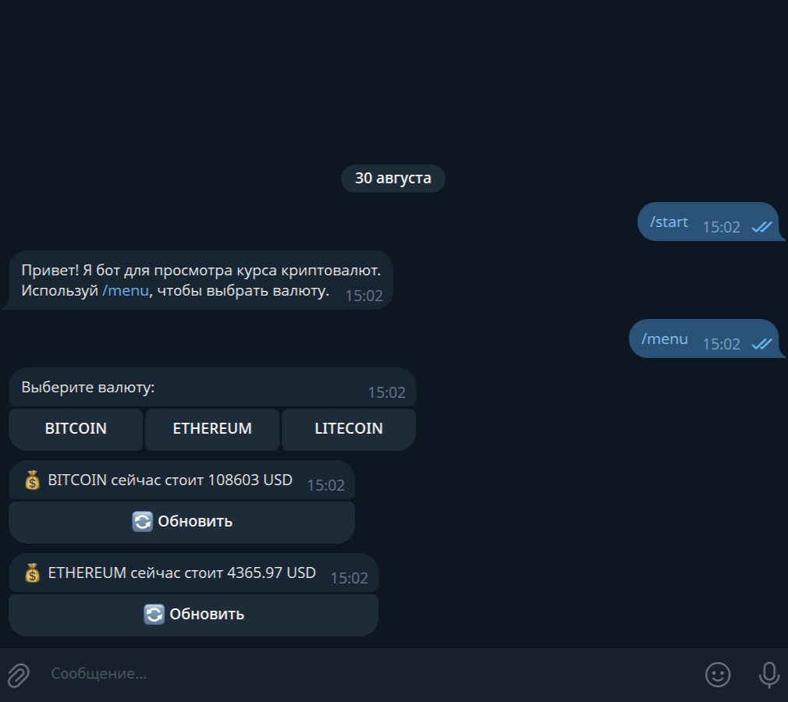
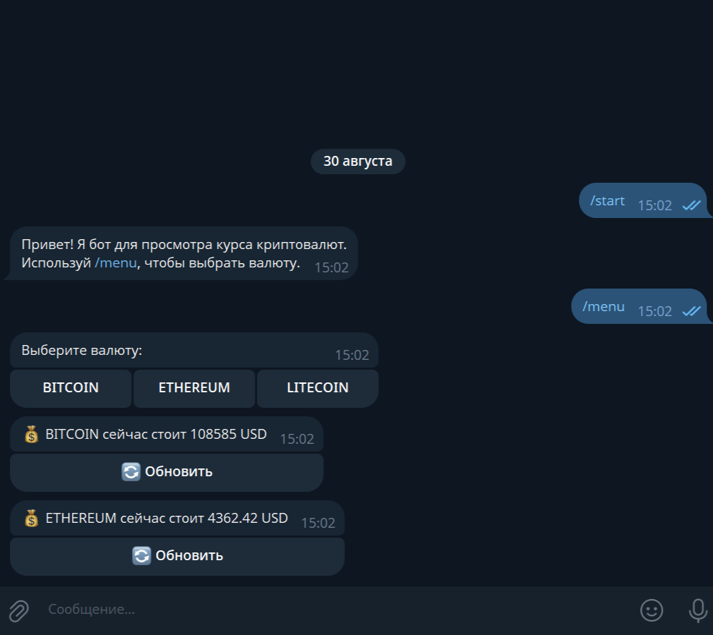

# CryptoPriceBot

**CryptoPriceBot** — Telegram-бот для отслеживания курса криптовалют в реальном времени. Поддерживает Bitcoin, Ethereum и Litecoin, отображает стоимость в USD и позволяет обновлять цену по нажатию кнопки.

---

## 📌 Функционал

- **Команда `/start`**  
  Отправляет приветственное сообщение и инструкцию по использованию бота.

- **Команда `/menu`**  
  Позволяет выбрать криптовалюту из списка поддерживаемых с помощью инлайн-клавиатуры.

- **Просмотр курса криптовалют**  
  Бот отображает актуальную цену выбранной валюты в USD.

- **Обновление курса**  
  Позволяет обновлять цену выбранной валюты с помощью кнопки, редактируя предыдущее сообщение.  
  Система кэширования предотвращает избыточные запросы к API.

- **Обработка ошибок**  
  - Обработка недоступности API или отсутствия данных.  
  - Обработка выбора неподдерживаемых валют.

---

## 💻 Технологии и зависимости

- **Python**  
- **aiogram==3.22.0**  
- **python-dotenv==1.1.1**  
- **aiofiles==24.1.0**
- **httpx==0.28.1**

**API:** [CoinGecko API](https://api.coingecko.com/api/v3)

---

### Создание файла `.env`

1. В корне проекта создайте файл с именем `.env`
2. Откройте `.env` в любом текстовом редакторе и добавьте одну строку:

```ini
TOKEN=ВАШ_ТОКЕН
```

- ⚠️ Вставляйте токен без пробелов и кавычек после TOKEN=

---

## ⚙️ Установка и запуск

```bash
# Клонируем проект или скачиваем архив

# Создаем виртуальное окружение
python -m venv .venv

# Активируем виртуальное окружение на Windows
.venv\Scripts\activate

# Активируем виртуальное окружение на Linux/Mac
source .venv/bin/activate

# Устанавливаем зависимости
pip install -r requirements.txt

# Запускаем бота
python main.py
```

---

## ⚡ Особенности

- Асинхронные запросы к API с использованием **httpx**.
- Инлайн-клавиатуры обеспечивают удобное и интерактивное взаимодействие с ботом.
- Кэширование цен предотвращает избыточные запросы к бесплатному API и снижает нагрузку.
- Чистая архитектура кода с разделением роутеров для `/start`, `/menu` и обработки callback.
- Поддержка нескольких криптовалют с возможностью расширения списка.
- Обработка ошибок API и некорректного выбора валют для надежной работы бота.

---

## 📸 Скриншоты и демонстрация

### Главное меню


### Просмотр курса


### Обновление курса
