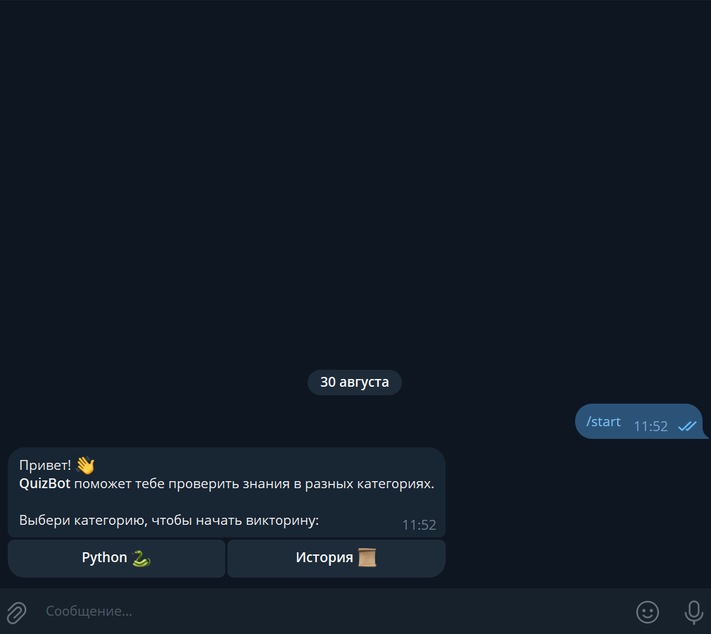
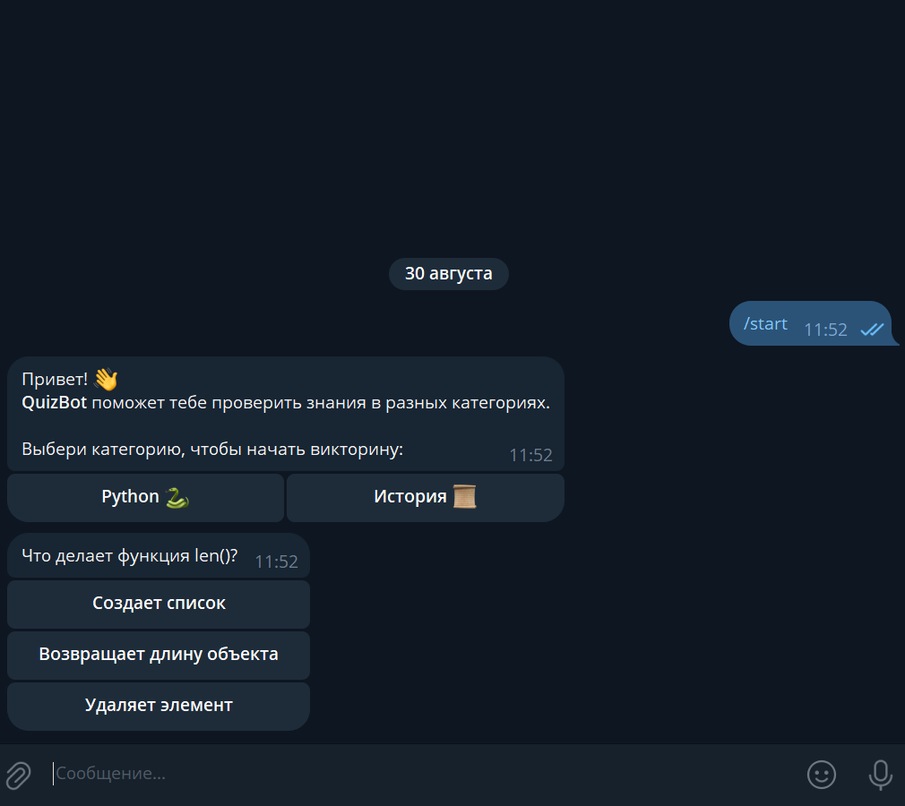
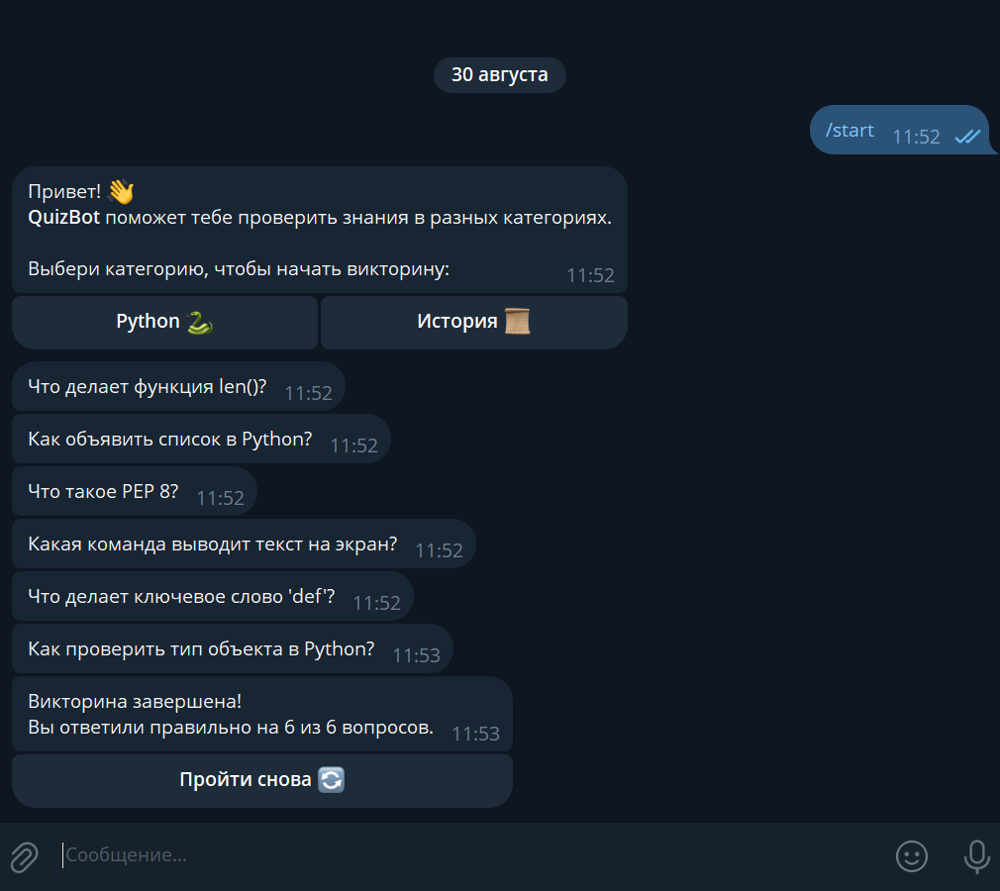
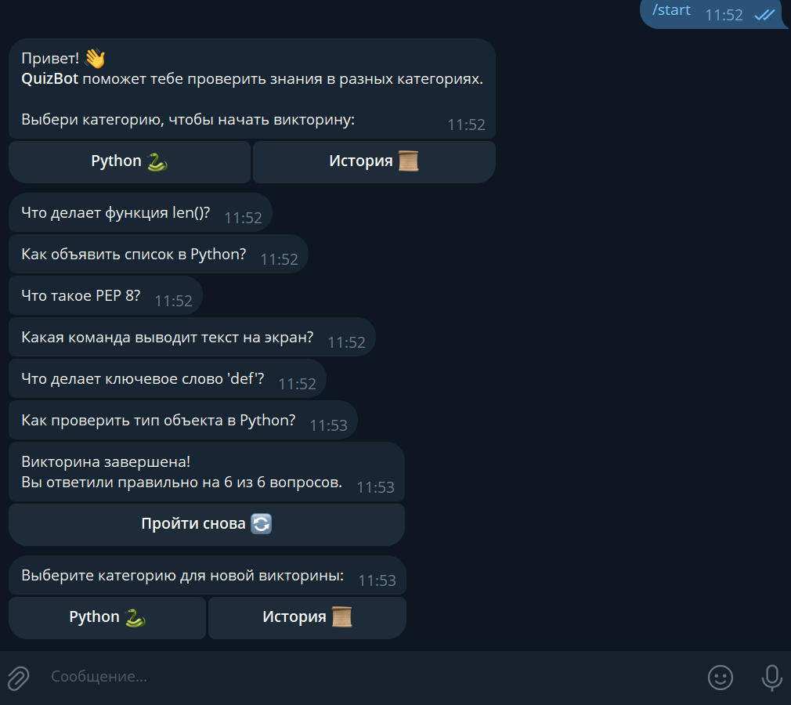

# QuizBot — Викторина в Telegram

**QuizBot** — это простой Telegram-бот для проведения викторин по категориям. Пользователь выбирает категорию, отвечает на вопросы, а бот подсчитывает количество правильных ответов и позволяет пройти викторину снова.

---

## 🚀 Основные возможности

- Приветствие при команде `/start` с прикрепленной инлайн-клавиатурой для выбора категории:
  - **Python 🐍**  
  - **История 📜**
- **Прохождение викторины**:
  - Каждая категория содержит **6 вопросов**, у каждого вопроса **3 варианта ответа**.
  - После выбора варианта ответа инлайн-клавиатура скрывается, чтобы пользователь случайно не нажал повторно.
  - FSM контролирует прогресс пользователя и подсчет правильных ответов.
- **Ограничение на начало новой викторины**:
  - Если пользователь находится в процессе викторины, при попытке выбрать категорию появляется `show_alert`: "Сначала завершите текущую викторину!".
- **Результат викторины**:
  - После всех вопросов бот отправляет сообщение:  
    `"Викторина завершена! Вы ответили правильно на X из 6 вопросов."`
  - Прикрепляется инлайн-кнопка **Пройти снова 🔄**, которая позволяет начать новую викторину.

---

## 💻 Технологии и зависимости

- **Python**  
- **aiogram==3.22.0**  
- **python-dotenv==1.1.1**  
- **aiofiles==24.1.0**

---

### Создание файла `.env`

1. В корне проекта создайте файл с именем `.env`
2. Откройте `.env` в любом текстовом редакторе и добавьте одну строку:

```ini
TOKEN=ВАШ_ТОКЕН
```

- ⚠️ Вставляйте токен без пробелов и кавычек после TOKEN=

---

## ⚙️ Установка и запуск

```bash
# Клонируем проект или скачиваем архив

# Создаем виртуальное окружение
python -m venv .venv

# Активируем виртуальное окружение на Windows
.venv\Scripts\activate

# Активируем виртуальное окружение на Linux/Mac
source .venv/bin/activate

# Устанавливаем зависимости
pip install -r requirements.txt

# Запускаем бота
python main.py
```

---

## 🎯 Особенности

- FSM для отслеживания состояния викторины и подсчета правильных ответов.
- Инлайн-клавиатуры делают взаимодействие с ботом интерактивным.
- Простая и чистая архитектура кода для демонстрации навыков работы с **aiogram** и асинхронной логики.

---

## 📸 Скриншоты и демонстрация

### Главное меню


### Вопрос с вариантами ответов


### Результат викторины


### Повторная викторина
