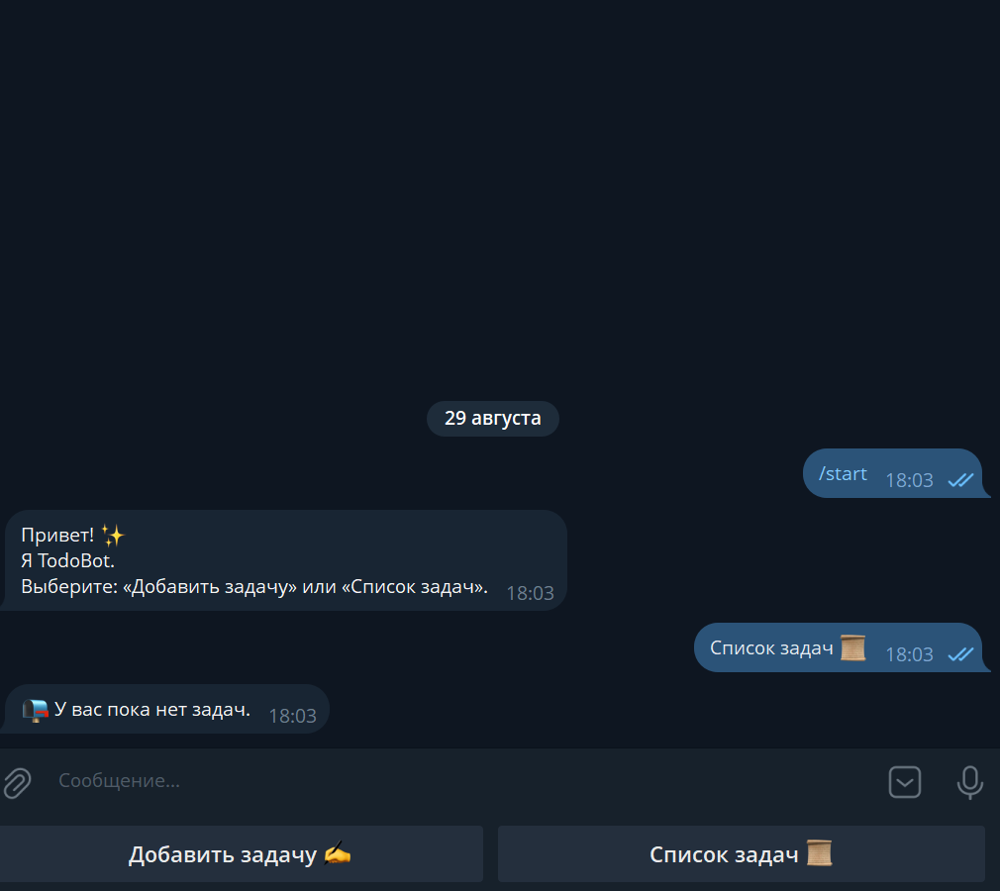
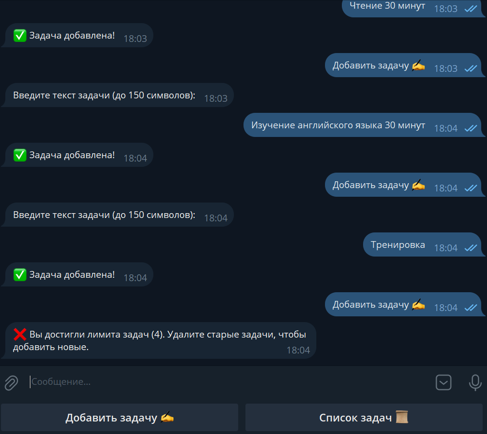
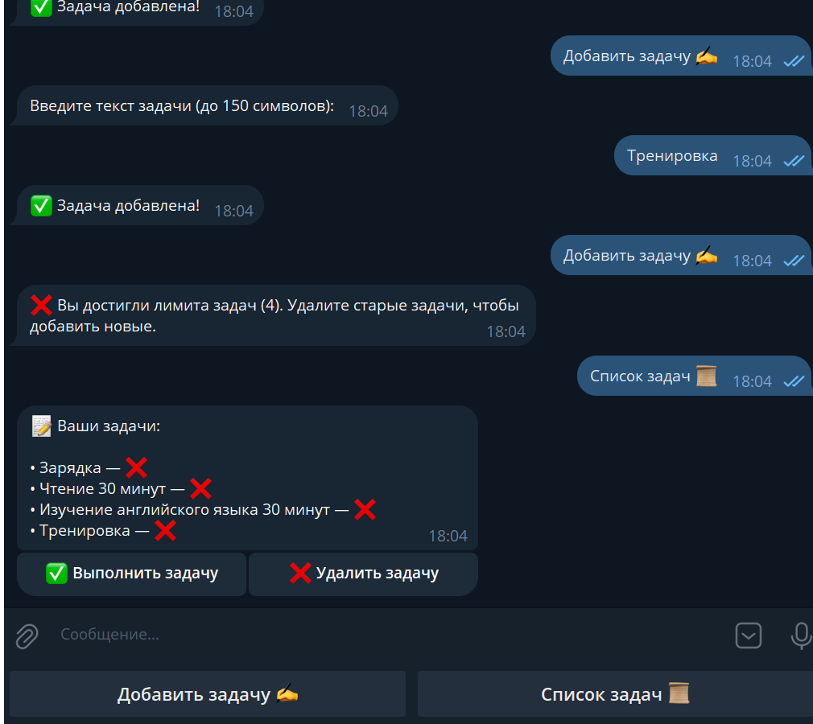
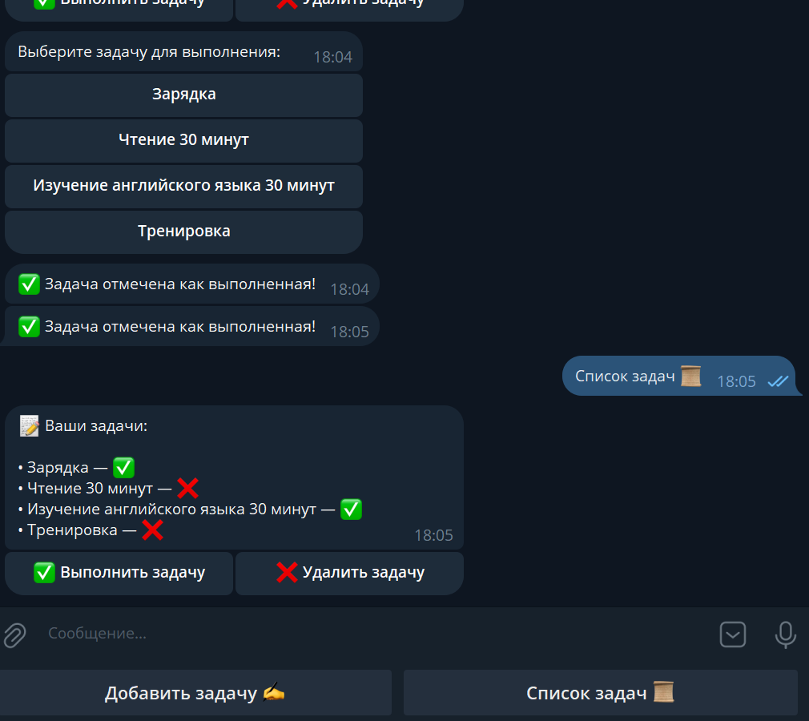
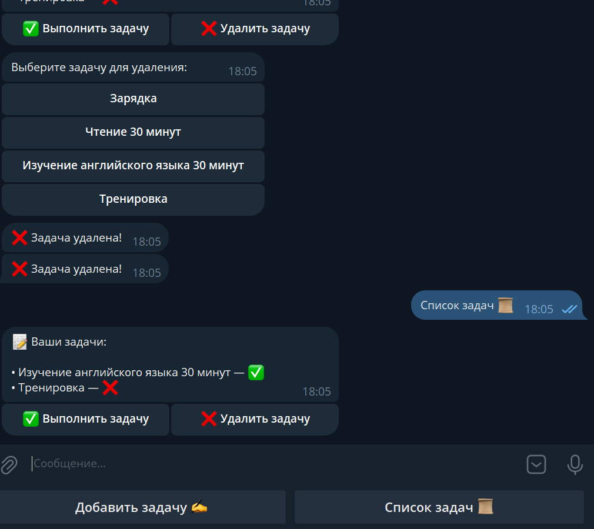

# TudoBot — Планировщик задач

**TodoBot** — это простой Telegram-бот для планирования задач. Позволяет пользователю добавлять задачи, отслеживать их статус и удалять их по мере необходимости.

---

## 🚀 Основные возможности

- Приветствие при команде `/start` с реплая-клавиатурой:
  - **Добавить задачу**  
  - **Список задач**
- **Добавление задачи**:
  - Ввод текста задачи до 150 символов.
  - Лимит: максимум **4 задачи на пользователя**.
  - Задачи сохраняются в базу данных с полями: `id`, `user_id`, `task`, `status`.
- **Просмотр списка задач**:
  - Отображение задач с их статусом (`Выполнено` / `Не выполнено`).
  - Инлайн-клавиатура с кнопками:
    - **Выполнить задачу**
    - **Удалить задачу**
- **Выполнение и удаление задачи** через инлайн-клавиатуру.

---

## 💻 Технологии и зависимости

- **Python**  
- **aiogram==3.22.0**  
- **python-dotenv==1.1.1**  
- **aiofiles==24.1.0**  
- **aiosqlite==0.21.0**

---

### Создание файла `.env`

1. В корне проекта создайте файл с именем `.env`
2. Откройте `.env` в любом текстовом редакторе и добавьте одну строку:

```ini
TOKEN=ВАШ_ТОКЕН
```

- ⚠️ Вставляйте токен без пробелов и кавычек после TOKEN=

---

## ⚙️ Установка и запуск

```bash
# Клонируем проект или скачиваем архив

# Создаем виртуальное окружение
python -m venv .venv

# Активируем виртуальное окружение на Windows
.venv\Scripts\activate

# Активируем виртуальное окружение на Linux/Mac
source .venv/bin/activate

# Устанавливаем зависимости
pip install -r requirements.txt

# Запускаем бота
python main.py
```

---

## 🎯 Особенности

- Лимит задач на пользователя (4).
- FSM для ввода задач и inline-клавиатуры делает взаимодействие интерактивным.
- Простая архитектура кода для демонстрации навыков работы с **aiogram** и асинхронными базами данных.

---

## 📸 Скриншоты и демонстрация

### Главное меню


### Добавление задачи


### Список задач


### Выполнение задачи


### Удаление задачи


